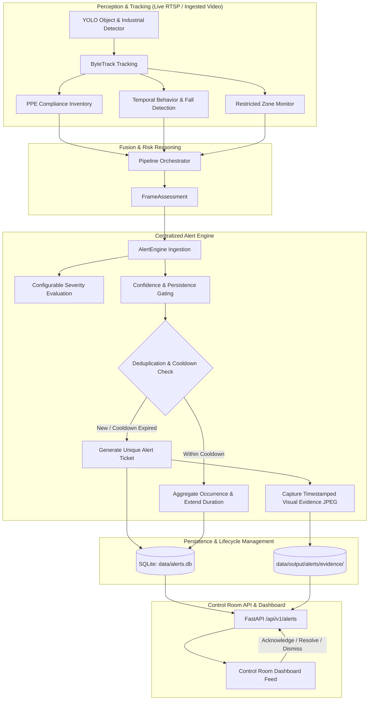
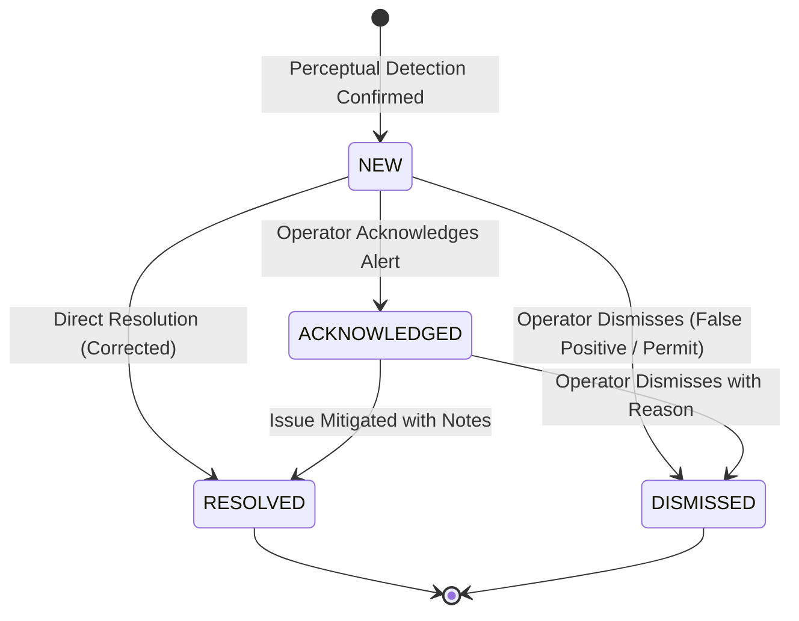

# Step 22 — Intelligent Safety Alerting, Evidence Capture & Alert Lifecycle

## 1. System Architecture & Event Flow

The IntelliWatch Alerting System converts perceptual detections and temporal behavioral events into actionable, traceable, and audited operator tickets.

---

## 2. Alert Severity Configuration

Alert severities are tiered based on industrial risk severity, life safety impact, and urgency:

| Violation Event | Severity Level | Immediate Alert Bypass | Description |
| :--- | :--- | :--- | :--- |
| `FALL_DETECTED`, `POSSIBLE_FALL` | `CRITICAL` | **Yes** (Immediate) | Confirmed worker fall or collapse; bypasses multi-frame persistence gating for rapid emergency response. |
| `RESTRICTED_ZONE_INTRUSION` | `HIGH` | Configurable | Worker unauthorized entry into restricted/high-voltage/machinery hazard zones. |
| `COMPOUND_SAFETY_EVENT` | `HIGH` | Configurable | Concurrent multiple safety factors (e.g. zone violation while unequipped). |
| `NO_HARDHAT`, `NO_SAFETY_VEST` | `HIGH` | No (Gated) | Missing mandatory personal protective equipment under OSHA/industrial standards. |
| `PERSON_VEHICLE_PROXIMITY` | `HIGH` | No (Gated) | Worker dangerously proximate to active forklift or industrial vehicle. |
| `NO_MASK`, `NO_GLOVES` | `MEDIUM` | No (Gated) | Missing secondary safety apparel. |
| `RAPID_MOVEMENT_EVENT` | `MEDIUM` | No (Gated) | Running or sudden evasive motion in controlled industrial floor. |
| `RESTRICTED_ZONE_DWELL` | `LOW` | No (Gated) | Worker stationary within monitored boundary exceeding dwell allowance. |
| `PROLONGED_STATIONARY_EVENT` | `LOW` | No (Gated) | Potential worker immobilization or non-responsive condition. |

---

## 3. Deduplication and Cooldown Windows

To prevent alert fatigue and notification storms during continuous video processing:
- **Deduplication Key**: `(camera_id, worker_tracking_id or 'unassigned', violation_type)`
- **Cooldown Window**: Configurable via `ALERT_COOLDOWN_SECONDS` (default: `30.0s`).
- **Continuing Violation Aggregation**: While a violation persists across video frames within the cooldown window, the existing ticket is updated:
  - `occurrence_count` increments.
  - `last_detected_at` updates to current timestamp.
  - Peak confidence is tracked.
  - No duplicate alert tickets or notifications are created.
- **Re-arming**: Once a worker leaves the hazard or the cooldown period elapses without violation, the detector re-arms. If the unsafe behavior recurs, a new alert ticket is created.
- **Missing / Unstable Tracking IDs**: Handled gracefully under an `unassigned` camera-level pool with spatial correlation to avoid duplicate storms when tracking briefly drops.
- **Camera Isolation**: Each camera's stream and workers are tracked strictly independently.

---

## 4. Evidence Storage & Retention

- **Location**: `data/output/alerts/evidence/evidence_{camera_id}_{alert_id}_{timestamp}.jpg`
- **Annotations**: Bounding box around worker/violation highlighted in color-coded severity (Red = Critical, Orange = High, Amber = Medium, Slate = Low).
- **Banner Watermark**: Top metadata banner including alert ID, camera ID, timestamp, and confidence score.
- **Resilience**: Handled gracefully if frames are empty or missing; metadata-only records are created with explicit disclosures.
- **Security**: File path boundaries are verified on API retrieval to prevent path traversal attacks.

---

## 5. Alert Lifecycle State Machine

- **NEW**: Ticket generated, awaiting control room review.
- **ACKNOWLEDGED**: Operator verified ticket and is in communication with floor supervisors.
- **RESOLVED**: Safety gear equipped or worker guided away; includes mitigation notes.
- **DISMISSED**: Requires a mandatory operator justification (e.g. authorized temporary permit or optical reflection).

---

## 6. REST API Endpoints

### 1. List and Filter Alerts
- `GET /api/v1/alerts`
- Query parameters:
  - `camera_id` (str): e.g. `cam_01`
  - `severity` (str): `CRITICAL`, `HIGH`, `MEDIUM`, `LOW`
  - `status` (str): `NEW`, `ACKNOWLEDGED`, `RESOLVED`, `DISMISSED`
  - `violation_type` (str): e.g. `NO_HARDHAT`
  - `track_id` (int): tracked worker ID
  - `start_time` / `end_time` (float): epoch range
  - `search` (str): text match
  - `page` (int, default 1)
  - `page_size` (int, default 20, max 100)

### 2. Alert Statistics
- `GET /api/v1/alerts/statistics`
- Returns lifetime totals, counts by severity, counts by status, counts by violation, and active unresolved tickets.

### 3. Alert Detail
- `GET /api/v1/alerts/{alert_id}`
- Returns full record including complete state transition audit history.

### 4. Lifecycle Actions
- `POST /api/v1/alerts/{alert_id}/acknowledge`
  - Body: `{"user": "operator", "notes": "..."}`
- `POST /api/v1/alerts/{alert_id}/resolve`
  - Body: `{"user": "operator", "notes": "Worker equipped hardhat"}`
- `POST /api/v1/alerts/{alert_id}/dismiss`
  - Body: `{"user": "operator", "reason": "Authorized maintenance"}` (reason is mandatory)

### 5. Visual Evidence Retrieval
- `GET /api/v1/alerts/{alert_id}/evidence`
  - Returns `image/jpeg` with security path boundary checking.

---

## 7. Known Limitations & Next Steps

1. **Short Video Clips**: Currently saves timestamped high-resolution JPEG evidence snapshot with bounding box overlay and watermark. Configurable short video clips (e.g. pre-roll/post-roll MP4 buffer) can be implemented in future video-encoding iterations.
2. **External Notification Gateways**: Webhooks, SMS (Twilio), and Email (SMTP) dispatchers can be attached directly to the `AlertEngine.process_violation_event` event trigger.
